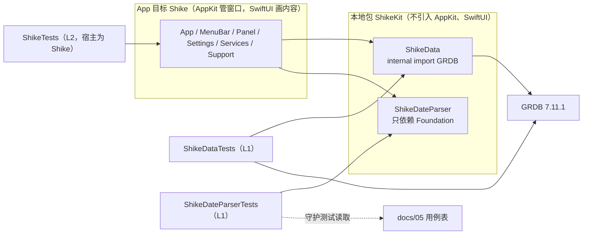
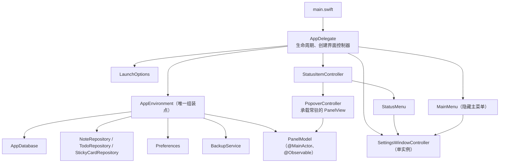
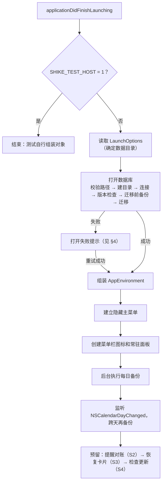
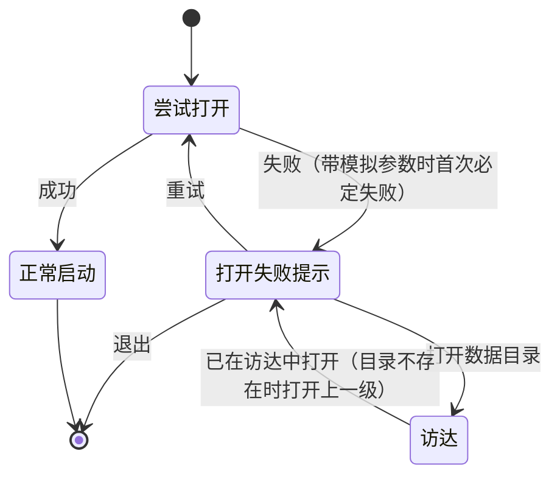
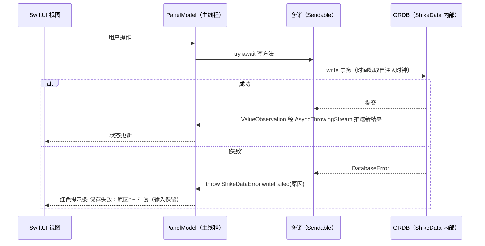
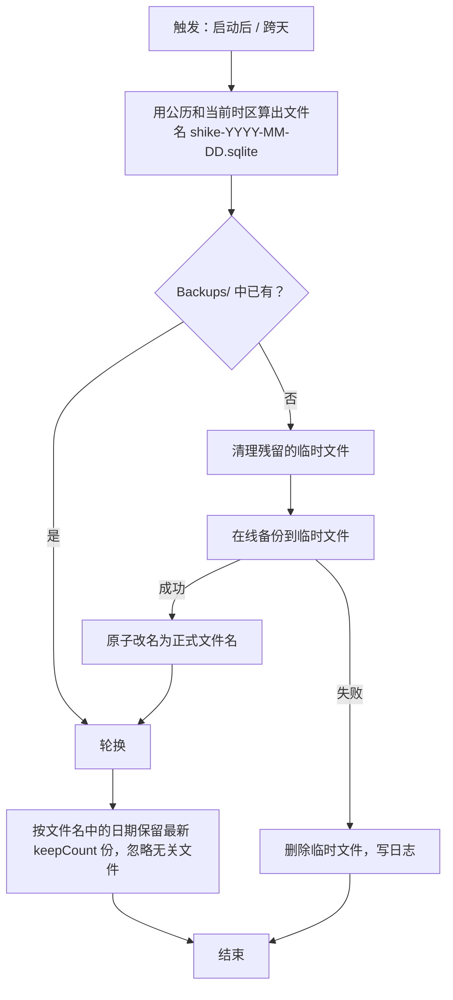

# 架构图

## 1. 模块与依赖

App 不直接依赖 GRDB，ShikeData 与 ShikeDateParser 之间没有依赖；这两条由 `checks` 作业和 `internal import` 共同守住。

```mermaid
graph LR
  subgraph AppTarget["App 目标 Shike（AppKit 管窗口，SwiftUI 画内容）"]
    AppCore["App / MenuBar / Panel / Settings / Services / Support"]
  end
  subgraph Kit["本地包 ShikeKit（不引入 AppKit、SwiftUI）"]
    Data["ShikeData<br/>internal import GRDB"]
    Parser["ShikeDateParser<br/>只依赖 Foundation"]
  end
  GRDB["GRDB 7.11.1"]
  AppTests["ShikeTests（L2，宿主为 Shike）"]
  DataTests["ShikeDataTests（L1）"]
  ParserTests["ShikeDateParserTests（L1）"]
  Doc05["docs/05 用例表"]
  AppCore --> Data
  AppCore --> Parser
  Data --> GRDB
  AppTests --> AppCore
  DataTests --> Data
  DataTests --> GRDB
  ParserTests --> Parser
  ParserTests -.->|守护测试读取| Doc05
```

## 2. 组装关系

```mermaid
graph TD
  Main["main.swift"] --> Delegate["AppDelegate<br/>生命周期、创建界面控制器"]
  Delegate --> Launch["LaunchOptions"]
  Delegate --> Env["AppEnvironment（唯一组装点）"]
  Env --> DB["AppDatabase"]
  Env --> Repos["NoteRepository / TodoRepository / StickyCardRepository"]
  Env --> Prefs["Preferences"]
  Env --> Backup["BackupService"]
  Env --> Panel["PanelModel（@MainActor、@Observable）"]
  Delegate --> MainMenu["MainMenu（隐藏主菜单）"]
  Delegate --> Status["StatusItemController"]
  Status --> Popover["PopoverController<br/>承载常驻的 PanelView"]
  Status --> StatusMenu["StatusMenu"]
  Delegate --> Settings["SettingsWindowController（单实例）"]
  Popover --> Panel
  StatusMenu --> Settings
  MainMenu --> Settings
```

## 3. 启动流程

```mermaid
flowchart TD
  A["applicationDidFinishLaunching"] --> B{"SHIKE_TEST_HOST = 1？"}
  B -->|是| Z["结束：测试自行组装对象"]
  B -->|否| C["读取 LaunchOptions<br/>（确定数据目录）"]
  C --> D["打开数据库<br/>校验路径 → 建目录 → 连接 → 版本检查 → 迁移前备份 → 迁移"]
  D -->|失败| E["打开失败提示（见 §4）"]
  E -->|重试成功| F
  D -->|成功| F["组装 AppEnvironment"]
  F --> G["建立隐藏主菜单"]
  G --> H["创建菜单栏图标和常驻面板"]
  H --> I["后台执行每日备份"]
  I --> J["监听 NSCalendarDayChanged，跨天再备份"]
  J --> K["预留：提醒对账（S2）→ 恢复卡片（S3）→ 检查更新（S4）"]
```

## 4. 数据库打开失败

```mermaid
stateDiagram-v2
  state "尝试打开" as Open
  state "正常启动" as Running
  state "打开失败提示" as Alert
  state "访达" as Finder
  [*] --> Open
  Open --> Running: 成功
  Open --> Alert: 失败（带模拟参数时首次必定失败）
  Alert --> Open: 重试
  Alert --> Finder: 打开数据目录
  Finder --> Alert: 已在访达中打开（目录不存在时打开上一级）
  Alert --> [*]: 退出
  Running --> [*]
```

## 5. 写入与观察

```mermaid
sequenceDiagram
  participant V as SwiftUI 视图
  participant M as PanelModel（主线程）
  participant R as 仓储（Sendable）
  participant G as GRDB（ShikeData 内部）
  V->>M: 用户操作
  M->>R: try await 写方法
  R->>G: write 事务（时间戳取自注入时钟）
  alt 成功
    G-->>R: 提交
    G-->>M: ValueObservation 经 AsyncThrowingStream 推送新结果
    M-->>V: 状态更新
  else 失败
    G-->>R: DatabaseError
    R-->>M: throw ShikeDataError.writeFailed(原因)
    M-->>V: 红色提示条"保存失败：原因" + 重试（输入保留）
  end
```

## 6. 每日备份

```mermaid
flowchart TD
  T["触发：启动后 / 跨天"] --> N["用公历和当前时区算出文件名 shike-YYYY-MM-DD.sqlite"]
  N --> X{"Backups/ 中已有？"}
  X -->|是| R["轮换"]
  X -->|否| P["清理残留的临时文件"]
  P --> W["在线备份到临时文件"]
  W -->|成功| MV["原子改名为正式文件名"]
  MV --> R
  R --> RR["按文件名中的日期保留最新 keepCount 份，忽略无关文件"]
  W -->|失败| L["删除临时文件，写日志"]
  RR --> Done["结束"]
  L --> Done
```
